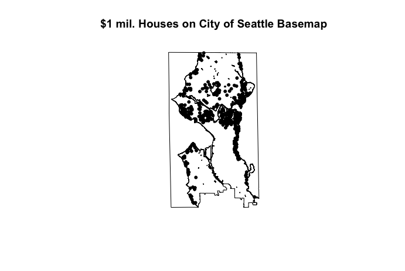
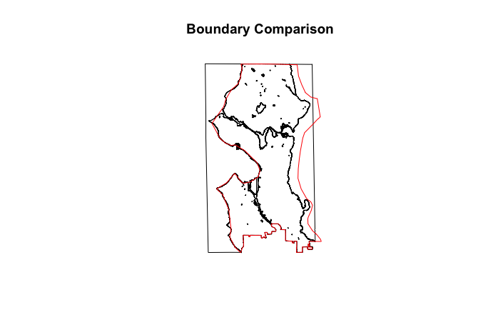
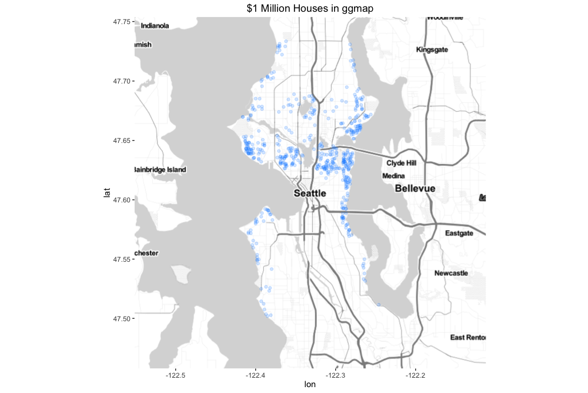

```{r setup, include=FALSE}
knitr::opts_chunk$set(echo = TRUE, message = FALSE, warning = FALSE)
library(sp)
library(rgeos)
library(raster)
library(rasterVis)
library(readr)
library(tidyr)
library(dplyr)
library(stringr)
library(ggplot2)
data.path <- '../input/kc_house_data.csv'
```

### Overview

In this kernel, we will map some of the largest and most expensive houses in Seattle.
We will demonstrate the use of `ggplot` on shapefiles, the `raster` package for field-type data, and the `rasterVis` package, 
which lets us map raster data in `ggplot`.

### House Data

We can subset right away to the fields we are using.

```{r load.csv}
kchouse <- read_csv(data.path) %>% select(id, long, lat, price, sqft_living, sqft_lot)
glimpse(kchouse)
```

### Basemap

We need a basemap and our choices are a little bit limited by the Kaggle kernels environment, which doesn't allow internet downloads.
We'll try working with a basemap from the R package `USCensus2000cdp`.
That package has maps for Census-defined places under the 2000 Census boundaries.
It has a Seattle boundary map.
An alternative would be to try to dig a basemap for King County out of the `maps` package.


```{r load.map, message=FALSE}
library(UScensus2000cdp)
data("washington.cdp")
seamap <- subset(washington.cdp, washington.cdp$name=='Seattle')
seamap <- SpatialPolygons(seamap@polygons, seamap@plotOrder, 
                         proj4string = CRS(proj4string(seamap)))
```

We changed `seamap` from `sp::SpatialPointsDataFrame` to `sp::SpatialPolygons` because we don't need any of the 2000 Census data.

### House Data as Spatial Data

We are mapping, so we will put the data into a spatial data structure.

```{r spatialize.data}
cos <- as.matrix(select(kchouse, long, lat))
hse <- as.data.frame(select(kchouse, -c(long, lat)))
hs.pts <- SpatialPointsDataFrame(cos, hse, proj4string=CRS(proj4string(seamap)))
hs.pts
```

To subset, we use the `%over%` operator.
For arguments of class `SpatialPoints` and `SpatialPolygons`, 
it returns a vector as long as the points, where each number is the 
index of the polygon containing the corresponding point, 
or NA if the point is not in any of the polygons.
See: `?over,Spatial,Spatial-method` for more information.

```{r spatial.subset}
hs.sea <- subset(hs.pts, !is.na(hs.pts %over% seamap))
```

We can also use `rgeos::gWithin` but the return types are weird, 
so it takes more fiddling.

```{r subset2, results='hold'}
isin <- gWithin(hs.pts, seamap, byid=TRUE)
class(isin)
dim(isin)
str(isin)
hs.sea2 <- subset(hs.pts, as.logical(isin))
```

The cast at the end is because `gWithin` returns a matrix, not a logical vector.
At this point we can do things like map the houses that sold for at least $1,000,000.

```{r million.bucks}
millions <- subset(hs.sea, price > 1000000)
plot(seamap, main='Seattle Homes for Over $1M')
plot(millions, add=T, pch=20)
```

We see that a lot of those are waterfront properties. 
And generally the expensive houses are North of downtown.
(Downtown is on the harbor on the West side)

### Shoreline Anomaly

There is a pretty obvious anomaly on the East shoreline, where the houses end well before the shore. 
I have investigated it locally/offline by plotting the house data on a shoreline/boundary map from the City of Seattle (that is, on a better map).
On the better map, the points look fine.
Here are the $1 million houses on the City basemap.



The anomaly seems to be due to excessive polygon smoothing in the map included in the `USCensus2000cdp` package. 
Here is a comparison of the boundaries between the City map and the one in `USCensus2000cdp`.



### Maps in ggplot

In `ggplot` the map is made like this:

```{r ggmillions}
g <- ggplot(seamap, aes(x=long, y=lat, group=group))
g <- g + geom_polygon(fill='lightblue')
millions.df <- as.data.frame(millions@coords)
g <- g + geom_point(data=millions.df, aes(x=long, y=lat), inherit.aes = FALSE)
g + coord_map()
```

The setting `inherit.aes=FALSE` is needed because the data in `millions.df`
is point data, so it does not have a `group` variable, so we have to reset `aes`.

### Maps with ggmap

*Hat Tip to
[AdhokshajaPradeep](https://www.kaggle.com/adhok93) in the kernel 
[Data Analysis with ggmap](https://www.kaggle.com/adhok93/d/foenix/slc-crime/data-analysis-with-ggmap) 
for this trick/workaround.*

The `ggmap` package allows downloads of a very wide range of maps as `ggplot` layers.
In the Kaggle kernels environment, we can't go out to an API, so we can't use `ggmap`.
Locally, I used the code below to produce this map as an image.



```{r echo=TRUE, eval=FALSE}
# Use: {r echo=TRUE, eval=FALSE} on chunk to see code without running it
sea.ggmap <- get_map(location='Seattle', source='stamen', zoom=11, maptype='toner-lite')
g <- ggmap(sea.ggmap)
g <- g + geom_point(data=millions.df, aes(x=long, y=lat), inherit.aes=FALSE,
                    color='dodgerblue', alpha=0.2)
g + ggtitle('$1 Million Houses in ggmap')
```

### Raster Maps

Raster maps are good for visualizing fields. 
We'll take a look at sales volume, and the average and maximum prices.
First we divide price by 1000 to avoid blowing up the legend.

```{r raster}
hs.sea$AdjPrice <- hs.sea$price/1000
sea.ext <- extent(bbox(seamap))
sea.raster <- raster(sea.ext, nrows=50, ncols=20)
ct.grid <- rasterize(hs.sea, sea.raster, field='id', fun='count')
plot(ct.grid, main='Count of Sales', xaxt='n', yaxt='n')
plot(seamap, add=T)
avg.grid <- rasterize(hs.sea, sea.raster, field='AdjPrice', fun=mean)
plot(avg.grid, main='Mean Price of Sales (in $1000)', xaxt='n', yaxt='n')
plot(seamap, add=T)
max.grid <- rasterize(hs.sea, sea.raster, field='AdjPrice', fun=max)
plot(max.grid, main='Max Price Home Sale (in $1000)', xaxt='n', yaxt='n')
plot(seamap, add=T)
```

The function `raster::rasterize` is the usual way of getting rasters from 
point and polygon objects from shapefiles, or point data from csv files.
In these examples, it takes a bare raster (which defines the cells), 
a variable to aggregate over each cell and an aggregation function. 
Essentially, it is doing spatial grouping and aggregation in these examples, 
grouping over the cells of the empty raster.

### Raster Package Classes

In the section above, `sea.raster` and the `*.grid` objects are of class `raster::RasterLayer`.
The `sea.raster` layer is empty, it just records the raster geometry.

```{r, searaster}
sea.raster
hasValues(sea.raster)
```

The `*.grid` objects have the geometry of `sea.raster`, 
but data aggregated out of `hs.sea`, 
which is of class `sp::SpatialPointsDataFrame`.

```{r avg.grid}
avg.grid
hasValues(avg.grid)
```

A very useful class from the `raster` package is called `brick`.
It is a data-aligned stack of rasters, 
useful when you have multiple variables of interest.
To make a brick, the layers have to have the same extent and resolution. 
We have that here, because we rasterized point data using the same empty raster to get these layers.

```{r lay.bricks}
sea.brick <- brick(ct.grid, avg.grid, max.grid)
names(sea.brick) <- c('SalesCt', 'AvgPrice', 'MaxPrice')
sea.brick
```

For layers and bricks, `raster::cellStats` can evaluate statistics over the layers.

```{r cellstats}
cellStats(sea.brick, summary)
```

### Raster Maps Using rasterVis and ggplot

The `rasterVis` package allows us to plot rasters with `ggplot`.
We kick things off with a call to `rasterVis::gplot`.   

*Note that there is one 'g' in `gplot`*

```{r ggraster}
g <- gplot(ct.grid) + geom_tile(aes(fill=value))
g <- g + scale_fill_gradient(low='white', high='blue', na.value='lightgray')
g <- g + geom_path(data=seamap, aes(x=long, y=lat, group=group), inherit.aes=FALSE)
g <- g + ggtitle('Count of Sales')
g + coord_map()
```

After that, we have a `ggplot` object, and we can add layers to it as usual.

